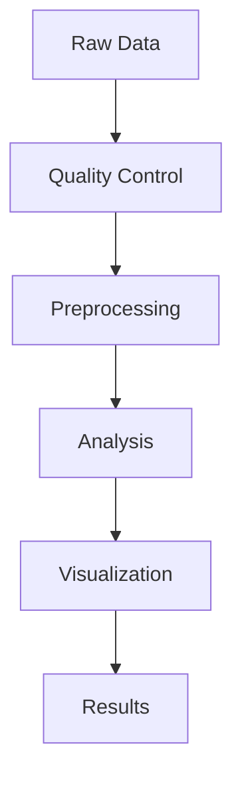

# [Pipeline Name]

**Department of Immunology - Harvard Medical School**

## Overview

Brief description of the pipeline's purpose and functionality.

## Features

- ✅ Feature 1
- ✅ Feature 2
- ✅ Feature 3
- 🔄 Feature in development
- 📋 Planned feature

## Pipeline Workflow



## Requirements

### System Requirements
- **OS**: Linux/macOS/Windows
- **Memory**: Minimum 8GB RAM (16GB recommended)
- **Storage**: 10GB free space

### Software Dependencies
- **R** (≥ 4.0.0) or **Python** (≥ 3.8)
- **Docker** (optional, for containerized execution)

### R/Python Packages
```r
# R packages
required_packages <- c("package1", "package2", "package3")
install.packages(required_packages)
```

```python
# Python packages
pip install package1 package2 package3
```

## Installation

### Option 1: Direct Installation
```bash
git clone https://github.com/hms-immunology/[repository-name].git
cd [repository-name]
```

### Option 2: Docker (Recommended)
```bash
docker pull hms-immunology/[pipeline-name]:latest
```

## Usage

### Quick Start
```bash
# Basic usage
./run_pipeline.sh input_data.csv output_directory/

# With custom parameters
./run_pipeline.sh input_data.csv output_directory/ --param1 value1 --param2 value2
```

### Input Format
The pipeline expects input data in the following format:
- **File type**: CSV, TSV, or Excel
- **Required columns**: 
  - `sample_id`: Unique sample identifier
  - `condition`: Experimental condition
  - Additional columns as specified

### Parameters

| Parameter | Type | Default | Description |
|-----------|------|---------|-------------|
| `--input` | string | required | Path to input file |
| `--output` | string | required | Output directory |
| `--threads` | integer | 4 | Number of processing threads |
| `--method` | string | "default" | Analysis method to use |

### Example
```bash
./run_pipeline.sh \
  --input data/samples.csv \
  --output results/ \
  --threads 8 \
  --method advanced
```

## Output Structure

```
output_directory/
├── quality_control/
│   ├── qc_report.html
│   └── qc_metrics.csv
├── processed_data/
│   ├── normalized_data.csv
│   └── filtered_data.csv
├── analysis_results/
│   ├── differential_analysis.csv
│   ├── pathway_analysis.csv
│   └── statistical_summary.csv
├── figures/
│   ├── qc_plots.pdf
│   ├── analysis_plots.pdf
│   └── summary_plots.pdf
└── logs/
    ├── pipeline.log
    └── error.log
```

## Advanced Usage

### Configuration File
Create a configuration file `config.yaml`:
```yaml
input:
  file_path: "data/input.csv"
  file_type: "csv"

parameters:
  quality_threshold: 0.8
  p_value_cutoff: 0.05
  fold_change_cutoff: 2.0

output:
  directory: "results/"
  format: ["csv", "xlsx"]
```

Run with configuration:
```bash
./run_pipeline.sh --config config.yaml
```

### Batch Processing
For multiple samples:
```bash
./batch_process.sh sample_list.txt output_base_directory/
```

## Testing

Run the test suite:
```bash
# Run all tests
make test

# Run specific test
python -m pytest tests/test_module.py
```

## Validation

The pipeline has been validated on:
- Dataset 1: [Description and reference]
- Dataset 2: [Description and reference]
- Benchmark data: [Description and reference]

## Performance

| Dataset Size | Processing Time | Memory Usage |
|--------------|----------------|--------------|
| Small (1K samples) | 5 minutes | 2GB |
| Medium (10K samples) | 30 minutes | 8GB |
| Large (100K samples) | 3 hours | 32GB |

## Troubleshooting

### Common Issues

**Error: Out of memory**
```
Solution: Increase available RAM or use --low-memory flag
```

**Error: Missing dependencies**
```
Solution: Run installation script ./install_dependencies.sh
```

**Error: Invalid input format**
```
Solution: Check input file format matches requirements
```

## Contributing

1. Fork the repository
2. Create a feature branch (`git checkout -b feature/new-feature`)
3. Commit changes (`git commit -am 'Add new feature'`)
4. Push to branch (`git push origin feature/new-feature`)
5. Create Pull Request

### Development Guidelines
- Follow code style guidelines
- Add tests for new features
- Update documentation
- Ensure all tests pass

## Changelog

### Version 1.0.0 (06/02/2025)
- Initial release
- Core pipeline functionality
- Basic documentation

## License

This project is licensed under the MIT License - see [LICENSE](LICENSE) file for details.

## Citation

If you use this pipeline in your research, please cite:

```
Ada, E. (2025). [Pipeline Name]: [Brief Description]. 
Department of Immunology, Harvard Medical School. 
GitHub repository: https://github.com/hms-immunology/[repository-name]
```

## Authors

- **Eren Ada, PhD** - *Principal Investigator* - [GitHub](https://github.com/erenada)

## Support

- 📧 Email: [contact-email]
- 🐛 Issues: [GitHub Issues](../../issues)
- 📖 Documentation: [Wiki](../../wiki)

---

*Last updated: 06/02/2025* 